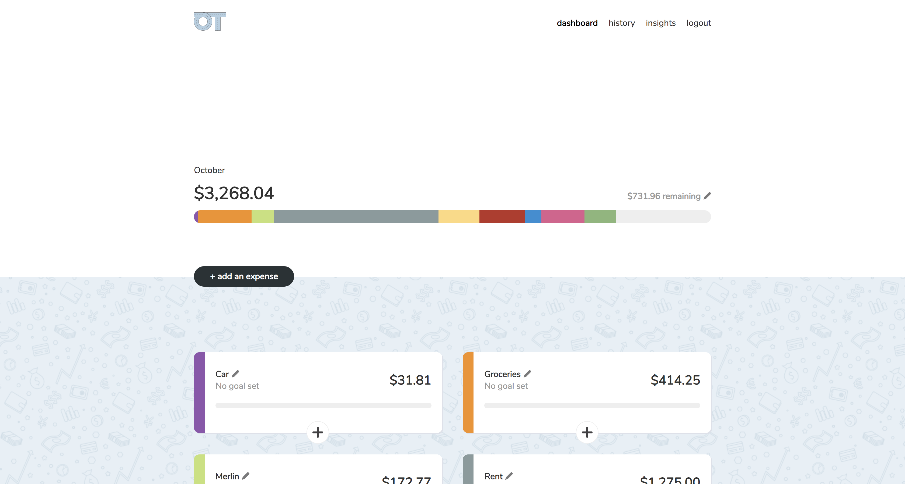
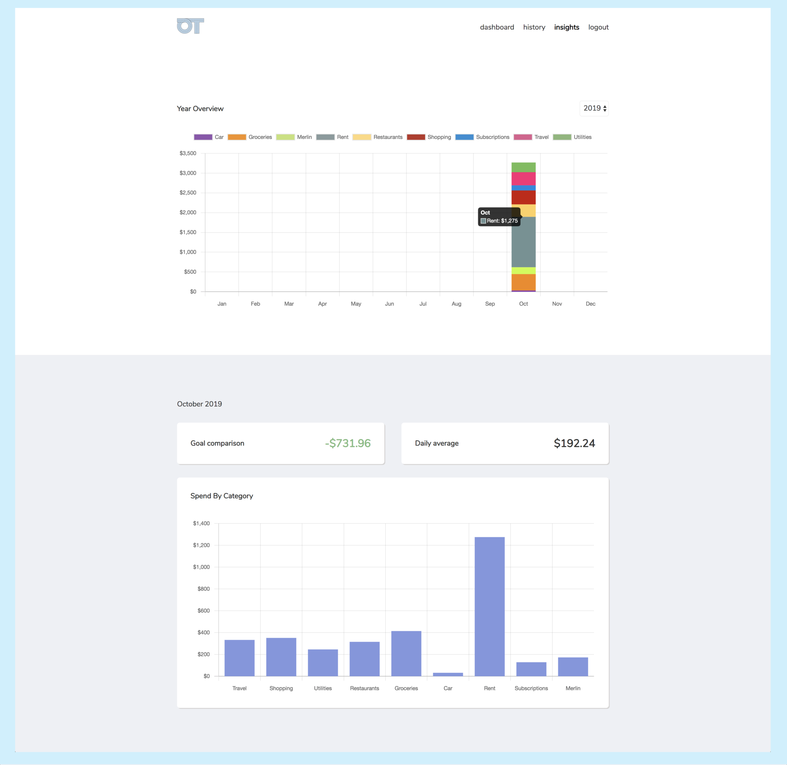
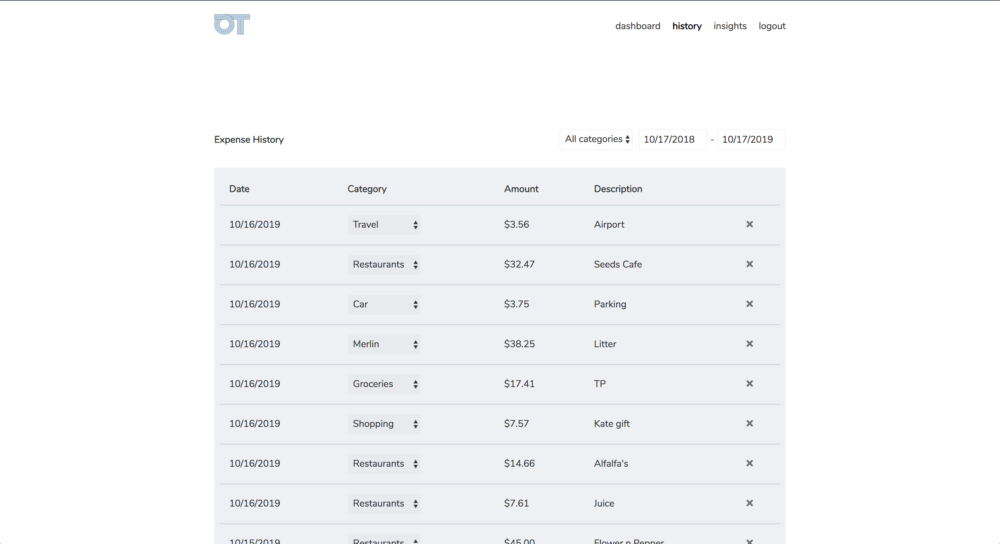
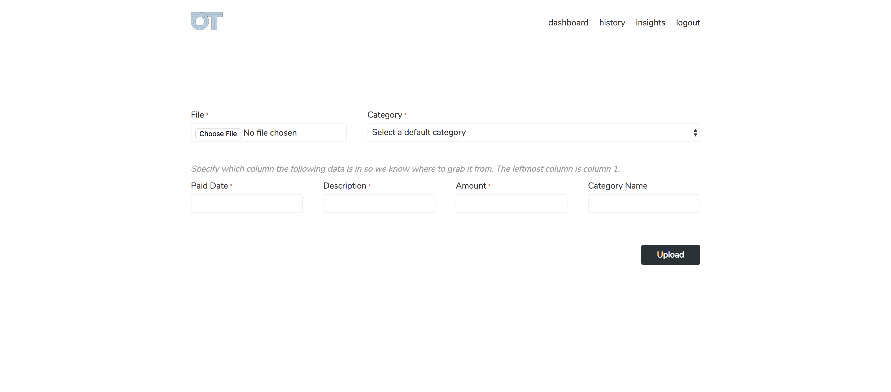
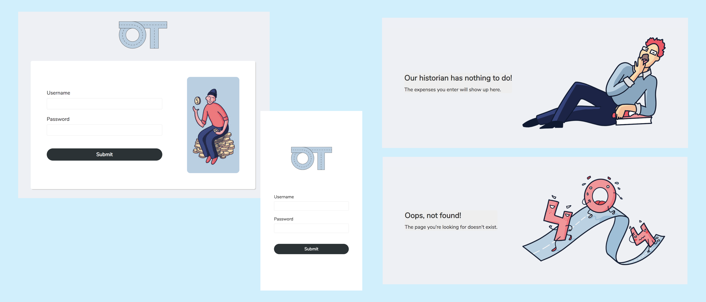

## About

In a nutshell: a private budgeting tool that can be self-hosted.

This project is an attempt to understand and control my own
spending better without giving my banking/financial info
to a 3rd party. The app is meant to be used with 1 login, and
you can host easily your own instance.

The app was designed by [Iana Noda](https://iananoda.com).

## Features

#### Dashboard
The dashboard lets you quickly see how you're doing in the current month.
You can set a spend goal per month and/or per category. This
is also where you quickly add individual expenses.

#### Insights
The insights page lets you review any year or month in more
detail.

#### History
The history page lets you drill down into actual purchases,
as well as do any tweaking (e.g. changing category or deleting).

#### Importing
Although you can't connect banking info, you can still streamline entering expenses.
The CSV import lets you flexibly import expenses from bank exports.

#### Fun and mobile friendly
OnTrack has a light and fun voice that makes it a
pleasure to use. The entire app is also mobile
friendly.

## Installation
- [Install with Homebrew](docs/homebrew_install.md)
- [Install on Ubuntu 16.04+](docs/ubuntu_install.md)
- Spin up an instance (for free) using the Heroku deploy button below. Heroku account is required.

### Creating a user
- `bundle exec rails c` to run Rails console
- `User.create!(username: "...", password: "...")` The username and password will be hashed.
- If you ever need to change your username/password: `User.first.update!(username: "...", password: "...")`

## Hosting your own
I'd recommend using [Heroku](https://heroku.com) since it's super simple (and free) to
deploy a Rails app. Keep it awake with my [Heroku Pinger](https://github.com/inoda/heroku-pinger)!
Once your instance is deployed, do the "Creating a user" steps
above after [spinning up Heroku's console](https://devcenter.heroku.com/articles/heroku-dashboard#application-overview).

## Usage and feedback
Feel free to use this however you'd like! If you use this, credit
would be nice but I don't really care that much. I'm primarily maintaining
this for my own use cases. But...if you have features you'd like to see built, or changes
that you think should be made, please open issues on this repo and tag me in them!
I'd love to improve the tool from your feedback.
